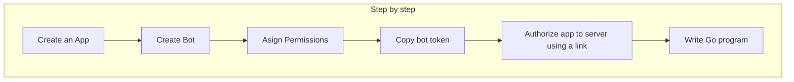

# Discord Bot

#### :link: [Discord Developers Doc](https://discord.com/developers/docs/intro)

We need to have a Discord account and a Server with **Admin's role**. We also need to activate **developer mode** in Discord Configurations/Advanced.

### Steps

---

#### 1. Create a Discord App
:link: [Discord Applications](https://discord.com/developers/applications)
- Click on "New Application" button.
- Choice a name to the app and create.

#### 2. Create Bot
:link: [Discord Bot](https://discord.com/developers/applications/bot)

- Click on "Add bot"
- Assign permissions (send messages, mention, send TTS message, etc)
- Set auth: OAuth2 &rarr; General

#### 3. Copy bot TOKEN
In tab **Bot**:
- Click on "Reset Token" and copy that.
- Copy the token and store for later

#### 4. OAuth2 URL Generator: Authorize App to server
:link: [OAuth2](https://discord.com/developers/applications/oauth2) tab

- Set the permissions (send messages, mention everyone, etc.)
- Copy the URL generated. 
  - Example: https://discord.com/oauth2/authorize?client_id=1234&permissions=1234&scope=bot

#### 5. Add bot to a channel using the URL

:link: https://discord.com/oauth2/authorize?client_id=[client_id]&permissions=[permissions]&scope=bot

---